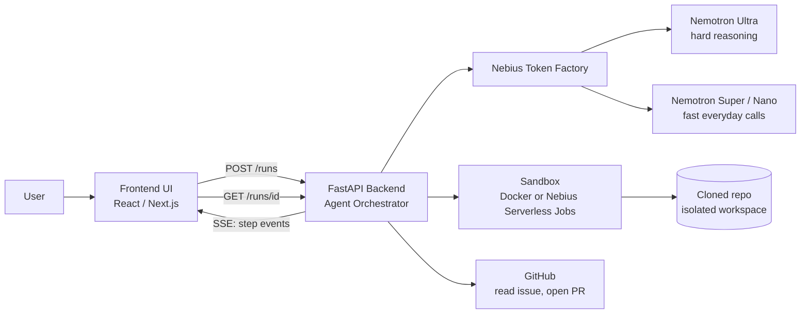

# Architecture

Working title: **ProofFix** (verified bug-fix agent)

The agent never shows a fix until it has proved the fix works: a test that fails before the fix and passes after it, plus no regressions in the existing tests.

## 1. System diagram



## 2. Components

| Component | Owner | What it does |
|---|---|---|
| Frontend UI | Arun | Input screen, live agent timeline, diff viewer, results |
| FastAPI backend / orchestrator | Vishaal | Runs the agent loop, calls models, streams events |
| Model layer (Token Factory) | Vishaal | One client wrapper, routes each task to the right Nemotron model |
| Sandbox | Shruthika | Runs tests and generated code safely: timeout, memory limit, no network |
| GitHub integration | Shruthika | Clone repo, read issue, create branch and pull request (stretch) |
| Demo bugs and QA | Ishitha | Buggy demo repos, test checklist, success metrics |

## 3. Agent loop

1. **Understand**: read the issue, scan the repo, find the relevant files, summarize the likely cause.
2. **Reproduce**: write a test that reproduces the bug. Run it in the sandbox and confirm it **fails**. If it passes, the test does not reproduce the bug, so rewrite it.
3. **Fix**: generate a code fix and apply it as a patch in an isolated workspace.
4. **Verify**: run the new test and the full existing test suite in the sandbox. The new test must pass and nothing else may break.
5. **Retry**: if verify fails, send the error output back to the reasoning model, change the approach, and go back to step 3. Stop after `MAX_ATTEMPTS` (default 3).
6. **Review**: a second model reviews the patch for side effects, risky changes, and quality. Output is a verdict (`approve`, `concerns`) with notes.
7. **Deliver**: return the diff, the new test, before/after test results, the review, and a plain-English explanation. Optionally open a pull request.

If all attempts fail, deliver an honest "could not fix" result with what was tried and the last error. Do not hide failures.

## 4. Model routing

Models are configured through environment variables so we can swap them without code changes. Confirm exact model IDs in the Token Factory console.

```
MODEL_REASONING=<Nemotron Ultra model id>
MODEL_FAST=<Nemotron Super or Nano model id>
```

| Step | Task | Model type |
|---|---|---|
| Understand | Read and summarize individual files | Fast (Nano) |
| Understand | Decide which files matter and form a root-cause hypothesis | Reasoning (Ultra) |
| Reproduce | Write the failing reproduction test | Reasoning (Ultra) |
| Fix | Write the patch | Reasoning (Ultra) |
| Verify | Summarize long test logs and tracebacks | Fast (Nano) |
| Retry | Analyze why the attempt failed and choose a new approach | Reasoning (Ultra) |
| Review | Check the patch for side effects and quality | Fast/mid (Super) |
| Deliver | Write the plain-English explanation | Fast/mid (Super) |

Rule of thumb: **Ultra for decisions and code, Super/Nano for reading, summarizing, and formatting.** This keeps the app fast and credits stretched, and it is a point to mention in the submission.

## 5. Sandbox contract

```python
run_in_sandbox(repo_path: str, command: str, timeout_s: int = 60) -> dict
# returns:
# {
#   "exit_code": int,
#   "stdout": str,
#   "stderr": str,
#   "timed_out": bool
# }
```

Safety rules: no network access, CPU and memory limits, a fresh workspace per run, cleanup after the run.

## 6. Planned repo layout

```
/backend        FastAPI app, agent loop, model client, sandbox runner
/frontend       UI
/demo-bugs      buggy demo repos with issue text
/docs           architecture.md, api.md
README.md
LICENSE         (MIT)
.env.example    (never commit the real .env)
```
